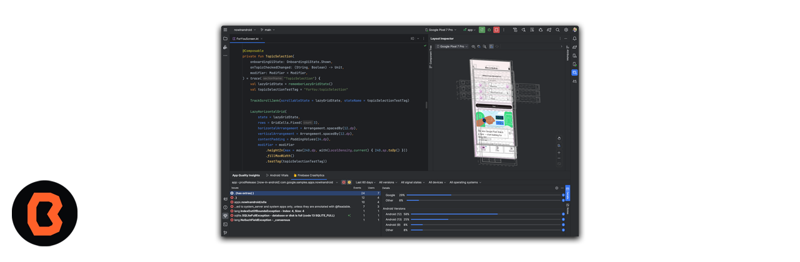

# Sesión 01 - Introducción al desarrollo móvil con Java 
Te damos la bienvenida a esta sesión de introducción a Java como lenguaje de programación.

## 🎯 Objetivo

Esta primera sesión comezarás con la **introducción** al desarrollo móvil con **Java**,aprenderáslas fases que contiene el desarrollo, conocerás los precedentes del desarrollo en el Sistema Operativo Android y lo más importante será conocer a nuestros compañeros.

 Figura. Imagen de Android Studio (Entorno de desarrollo) 

##  Temas

1. Presentación de los miembros del curso. La actividad será la siguiente:  
    * Te presentaras con tus compañeros empezando por tu nombre, área en la que trabajas o estudias y mencionaras un dato curioso sobre ti (puede ser un logro académico, un hobby o algo que te parezca relevante para compartir), esta dinámica es importante para el experto y tus compañeros ya que de esta manera podrán conocerte mejor.

2. ¿Qué es Java? 
    * Es un lenguaje de programación ampliamente utilizado para el desarrollo de software, aplicaciones móviles, macrodatos y tecnologías del servidor, es rápido, seguro y confiable.

    

3. Antecedentes Java. 
Daremos un repaso sobre la historia de Java desde su creación hasta su última versión.

    * Nacimiento del lenguaje: Java nació en junio de 1991 como un proyecto llamado "Oak"
    * Primera versión: a principios de 1996 se lanzó la primera implementación pública de Java 1.0.
    * Revolución en el desarrollo de software: Java tenía todas las cualidades requeridas para la programación en Internet, que estaba en auge en la década de 1990. 
    * Actualizaciones: Versiones nuevas periodicamente.
    * El futuro de Java: Inteligencia Artificial y Machine Learning

4. ¿Para qué se utiliza el lenguaje de programación Java?
    Java es un lenguaje versátil y de uso gratuito. Algunos usos comunes de Java incluyen:

    * Desarrollo de videojuegos: Muchos videojuegos para móviles y computadoras, se crean con Java. juegos modernos integran tecnología avanzada, como el machine learning o la realidad virtual.
    * Macrodatos: Java se usa para motores de procesamiento de datos masivos.
    * Inteligencia artificial: Gracias a su gran bibliotecas de machine learning Java es perefecto para el desarrollo de aplicaciones de inteligencia artificial.
    * Internet de las cosas: Gracias a Java sensores y hardware en dispositivos es posible conectarse de forma independiente a internet.

5. Aplicaciones con Java  
Finalmente hablaremos de las aplicaciones más populares desarrolladas en Java, a continuación algunas de las mas populares.
    * WorldWind: 
     World Wind es un programa que actúa como un globo terráqueo virtual desarrollado en Java.
    * Minecraft:
     El videojuego de bloques y uno de los más vendidos de la historia, fue desarrollado inicialmente en Java.
    * IntelliJ IDEA: 
     Herramienta para codificar y crear aplicaciones en Java.
    * VisibleTesla:
     Se utiliza para monitorizar y controlar el vehículo Tesla Model S

## 📝 Organización de la clase

- [Presentación - Sesión 01](presentacion/Sesion-01.pptx)