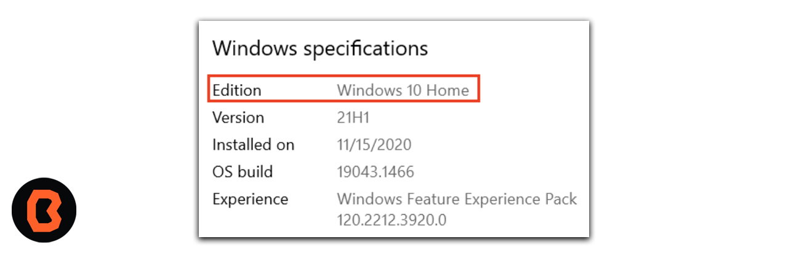
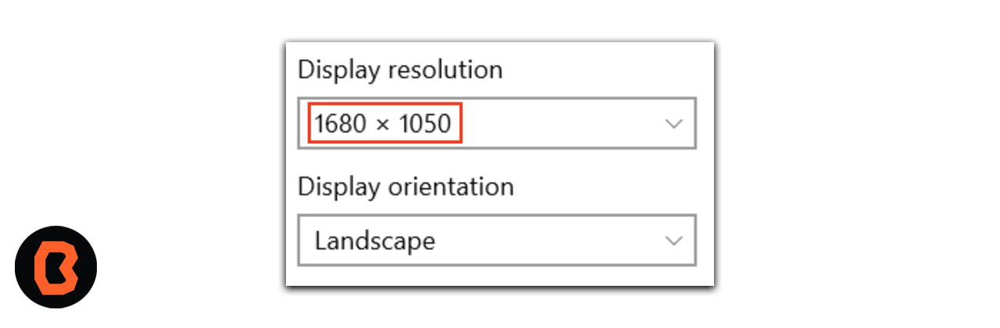

# Sesión 02 - Instrucciones para Instalar Alternativa de Emulador "Memu" (Opcional)

* Puedes instalar una versión mas ligera de emulación para tus practicas, a continuación te dejamos las instrucciones para que puedas descargarlo e instalarlo.

Antes de comenzar recuerda que estos son los requisitos minimos para una correcta instalación.

<ul>
    <li> Microsoft® Windows® 8/10/11 de 64 bits </li>
    <li> Arquitectura de CPU x86_64; procesador Intel Core de segunda generación o posterior, o CPU AMD compatible con un hipervisor de Windows </li>
    <li>8 GB de RAM o más </li>
    <li>4 GB de espacio disponible en el disco como mínimo </li>
</ul>

## Verificar los requisitos del sistema (Windows 10)

A continuación se muestran los pasos que tienes que seguir para una correcta instalación.

1. Abre Configuración.
2. Haz clic en Sistema.
3. En la parte inferior del panel de navegación de la izquierda, haz clic en Acerca de.
4. Asegúrate de que las especificaciones de Windows cumplan o superen los requisitos.

5. Selecciona Especificaciones del dispositivo. Asegúrate de que la RAM instalada sea, al menos, la requerida, y que el tipo de sistema sea la versión de 64 bits del sistema operativo.

6. En el panel de navegación, haz clic en Pantalla. Asegúrate de que la Resolución sea la requerida o una mejor.

## Como descargarlo

Abre tu navegador y accede al siguiente enlace <a href="https://www.memuplay.com/es/">Descarga Memu Emulador</a>

1. Haz clic en descargar Memu. Comenzará la descarga.

## Instalación

1. Despúes de descargar la aplicación ejecutamos el programa y presionamos instalar rápidamente.

2. Ya que instalaste el programa se iniciará el programa y verás esta pantalla.

3. Ahora tienes un nuevo emulador y puedes verificarlo abriendo Android Studio y creando un proyecto nuevo .

    > [Importante]
    > Para que Android Studio pueda trabajar con memu este debe estar siempre corriendo junto con Android Studio.
5. Ahora indentificarás que el emulador te muestra un dispositivo móvil virtual, esto puedes verificarlo en la parte de correr tu app y puedes elegir que dispositivo usarás en tus prácticas, para ello solo debemos ir a configuración como se muestra en la siguiente imagen.

## Felicidades

Ahora ya tienes una alternativa de emulación más ligera que la propia de Android Studio.
