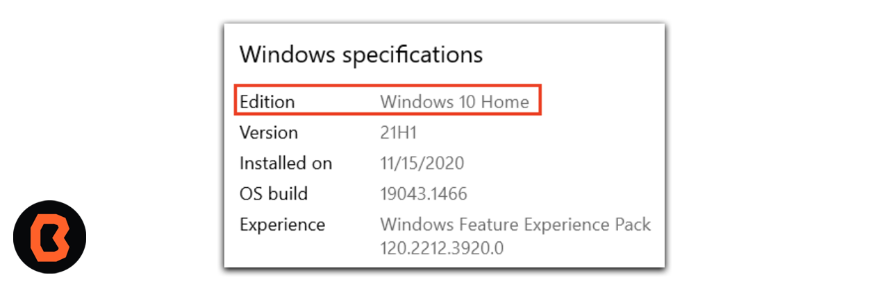
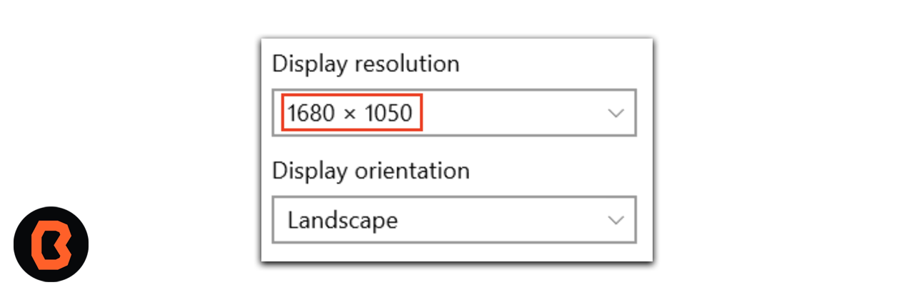

# Sesión 02 - Instrucciones para Instalar Android Studio

Ahora vas a instalar Android Studio siguiendo los siguientes pasos.

## Verificar los requisitos del sistema (Windows 10)

A continuación se muestran los pasos que tienes que seguir para una correcta instalación.

1. Abre **Configuración**.
2. Haz clic en **Sistema**.
3. En la parte inferior del panel de navegación de la izquierda, haz clic en **Acerca de**.
4. Asegúrate de que las especificaciones de Windows cumplan o superen los requisitos.

5. Selecciona Especificaciones del dispositivo. Asegúrate de que la RAM instalada sea, al menos, la requerida, y que el tipo de sistema sea la versión de **64 bits** del sistema operativo.

6. En el panel de navegación, haz clic en **Pantalla**. Asegúrate de que la Resolución sea la requerida o una mejor.

## Cómo descargarlo

Abre tu navegador y accede al siguiente enlace <a href="https://developer.android.com/studio?hl=es-419#get-android-studio">Descarga Android Studio</a>

1. Haz clic en **Download Android Studio**. Se abrirá la página de los Términos y Condiciones con el Contrato de licencia de Android Studio.
2. En la parte inferior de la página, selecciona la casilla de verificación **I have read and agree with the above terms and conditions** si estás de acuerdo con los Términos y Condiciones.
3. Haz clic en **Download Android Studio** para iniciar la descarga.
4. Cuando se te indique, guarda el archivo en una ubicación donde puedas localizarlo con facilidad, como la carpeta **Downloads**.

## Instalación

1. Abre la carpeta donde descargaste y guardaste el **archivo** de instalación de Android Studio.
2. Haz doble clic en el **archivo** descargado.
3. Si se muestra el diálogo User Account Control para permitir que la instalación realice cambios en tu computadora, haz clic en Yes para confirmar la instalación.

Despúes tendrás que dar **siguiente** a todas las ventanas que se abran durante la instalación

## Por último

Durante la instalación, el asistente de configuración descarga e instala componentes y herramientas adicionales que se necesitan en el desarrollo de apps para Android. Según la velocidad de tu conexión a Internet, es posible que este proceso demore un poco. Durante este período, es posible que veas un diálogo de User Account Control para el Procesador de comandos de Windows. Haz clic en ****Yes** (Sí) para aceptar el cuadro de diálogo.

## Felicidades

Ahora ya tienes tu entorno de desarrollo instalado correctamente.

