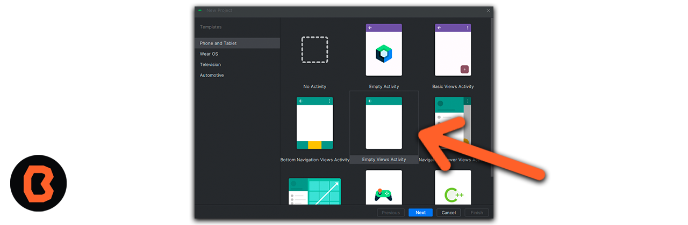
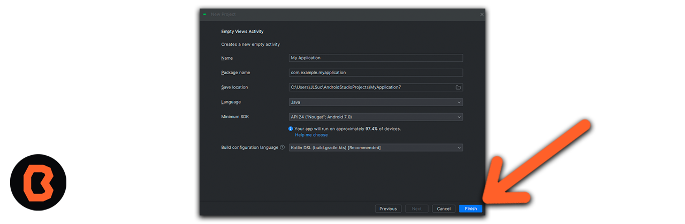
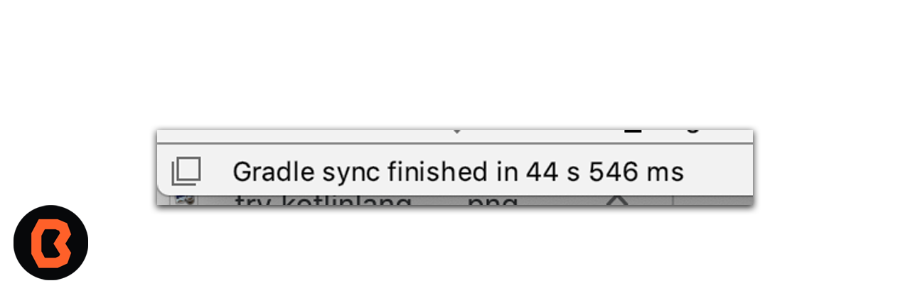
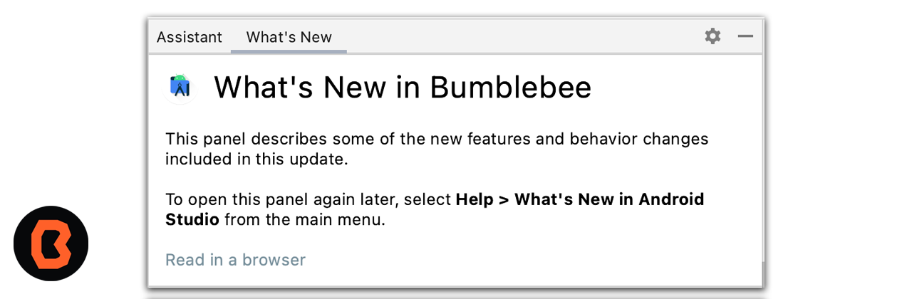
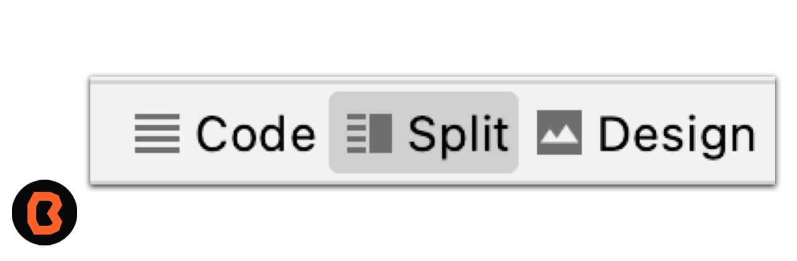

# Sesión 03 - Fundamentos Android e Introducción a Android Studio
En esta sesión serás capaz de identificar y configurar la estructura de un proyecto básico de Android.

## 🎯 Objetivo

Después de que descargaste Android Studio en esta sesión te vas a familiarizar con la interfaz de Android Studio, aprenderás cómo configurar tu entorno de desarrollo y cómo crear nuevos proyectos.

### Práctica en clase

La primera vez que iniciamos Android Studio nos monstrará una pantalla de bienvenida parecida a la que tenemos aquí abajo.

1. Para empezar a crear un proyecto nuevo, seleccionamos la opcion **Start a new Android Studio Project**.
* En Android Studio, una plantilla de proyecto proporciona el plano para un tipo de app determinado. Las plantillas crean la estructura del proyecto y los archivos necesarios de modo que Android Studio, compile tu proyecto. Según la plantilla que elijas, te brindará un código inicial para avanzar más rápido.
 

 2. A continuación elegimos el templete para nuestra apliación, en nuestro caso elegimos Empty Activity.

 Haz clic en la plantilla **Empty Activity** para armar tu proyecto con ella. La plantilla Empty Compose Activity es la que permite crear un proyecto simple que puedes usar a fin de compilar una app de Compose. Tiene una sola pantalla y muestra el texto "Hello Android!"

 Primero dominaremos los templetes básicos,posteriormente podrás intentar con otros estilos de templetes.
 

 3. Vamos a configurar nuestro proyecto.

 - 3.1 El campo Name se usa a fin de ingresar el nombre de tu proyecto. Para este tipo de codelab ingresa "Greeting Card".

- 3.2 Deja el campo Package name como está. Así se organizarán los archivos en la estructura de archivos. En este caso, el nombre del paquete será com.example.greetingcard.

- 3.3 Deja el campo Save location tal como está. Este contiene la ubicación en la que se guardan todos los archivos relacionados con tu proyecto. Toma nota de esa ubicación para encontrar tus archivos.

- 3.4 En el campo Language, selecciona **Java**.

- 3.5 Selecciona API 21: Android 5.0 (Lollipop) en el menú del campo Minimum SDK. Minimum SDK indica la versión mínima de Android en la que se puede ejecutar tu app.

- 3.6 La casilla de verificación Use legacy android.support libraries ya está desmarcada.

- 3.7 Haz clic en Finish. Ese proceso puede tardar un poco, así que aprovecha para disfrutar de un rico té. Mientras se configura Android Studio, un mensaje y una barra de progreso indicarán si aún se está configurando tu proyecto. Es posible que se vea de este modo:

 

4. Vamos a explorar las partes que conforman nuestro proyecto.

* Un mensaje similar a este te informará cuando se cree la configuración del proyecto.
 

* Es posible que veas el panel What's New que contenga actualizaciones sobre funciones nuevas en Android Studio. Ciérralo por ahora.

* En la esquina superior derecha de Android Studio, haz clic en Split. Esto te permitirá ver tanto el código como el diseño. También puedes hacer clic en Code para ver solo el código, o bien en Design para ver solo el diseño.

* Después de presionar Split, deberías ver tres áreas:

1. En la vista Project (1), se muestran los archivos y las carpetas de tu proyecto.
2. En la vista Code (2), puedes editar el código.
3. En la vista Design (3), se muestra una vista previa de cómo se ve tu app.

## Felicidades

Acabas de crear tu primer proyecto e indtificaste las secciones que lo componen.

## 📝 Organización de la clase

- [Práctica](Practica-01)
- [Presentación - Sesión 03](presentacion/Sesion-03.pptx)

