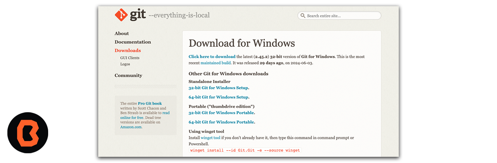
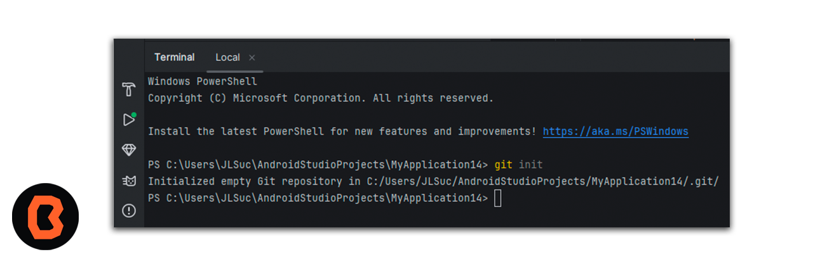
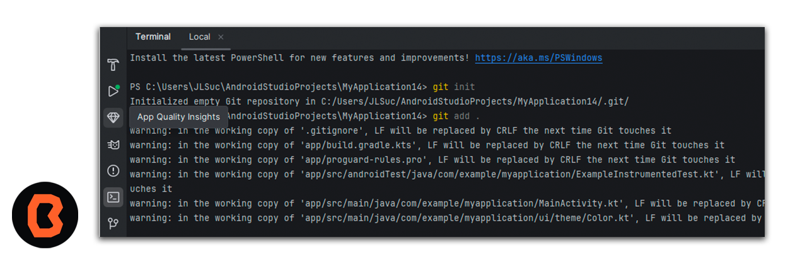
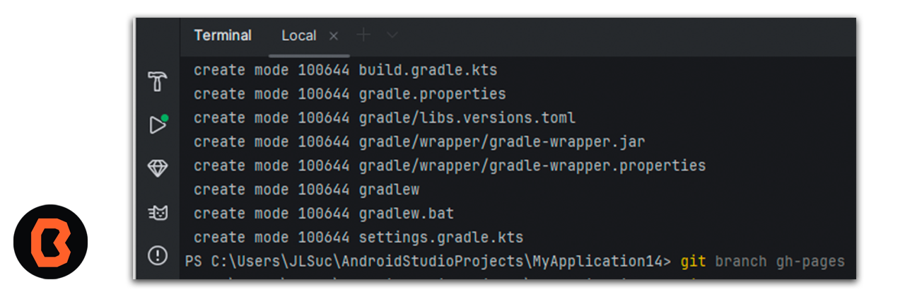
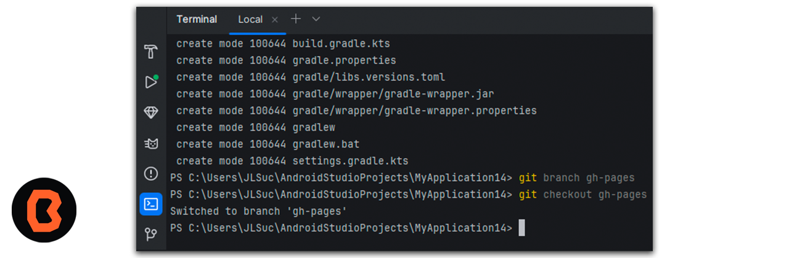
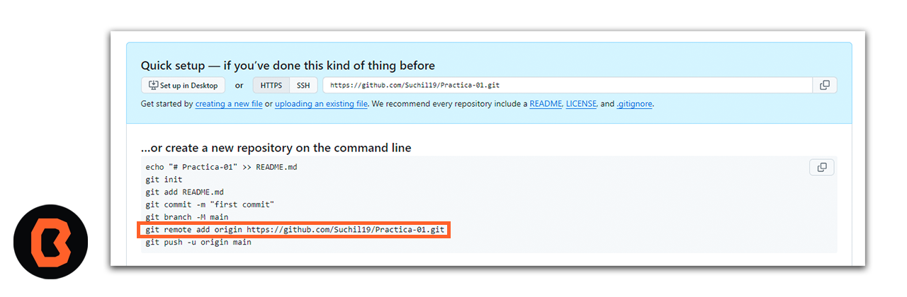
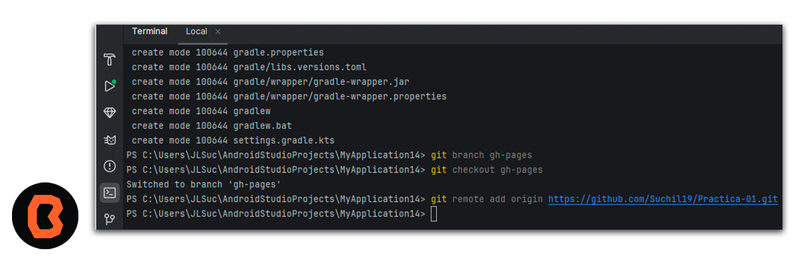
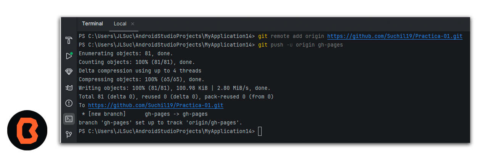

## Control de versiones con Git

Aprenderás a usar Git para subir y actualizar tus repositorios de manera fácil y rápida

## Instalación

Abre tu navegador y accede al siguiente enlace <a href="https://git-scm.com/download/win">Descarga Git</a>
 y selecciona la opción de 64 bit de esta manera un archivo comenzará su descarga, basta con ejecutarlo e instalarlo.

Ahora vamos a abrir una terminal desde nuestro escritorio y vamos a escribir **git --version** 

Ahora te vas a dirigir a Android Studio y vamos a abrir una nueva terminal para que puedas subir tu práctica y cambios a un repositorio de GitHub. Lo que sigue es escribir la siguiente linea **git init** este comando crea un nuevo repositorio de Git

Una vez que inicializamos el repositorio tienes que escribir **git add .** para mover los cambios del directorio de trabajo al área del entorno de ensayo.

Continua escribiendo **git commit -m "Primer commit"** este comando es una confrmación, las confirmaciones representan hitos dentro del proyecto de Git.
Para tener acceso a estas confirmaciones, es necesario el comando git commit . Sirve para capturar exactamente el estado del proyecto en un momento concreto, después de realizar la captura, las confirmaciones instantáneas son almacenadas en el repositorio local de Git.

Ahora escribe **git branch gh-pages** El comando git branch permite crear una rama nueva.
Una rama o branch es una versión del código del proyecto sobre el que estás trabajando.

Ahora escribe **git checkout gh-pages** esto te permite desplazarte entre las ramas creadas por git branch.

Recuerda que creaste un repositorio en github donde vamos a subir esta práctica, por favor dirigete a Github y copia la siguiente linea de comando. 

Ahora pega esa linea de comando en la terminal de esta manera.

Por último lo que tienes que hacer es un **git push -u origin gh-pages** con esta linea de comando lograremos subir todo lo que se ha agregado.

## Felicidades
 Acabas de crear un repositorio en Github y haz manejado un control de versiones.