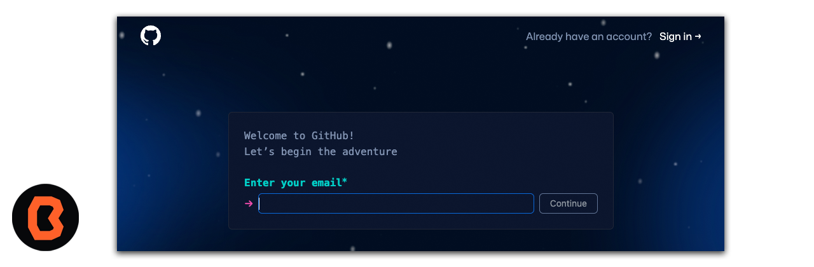
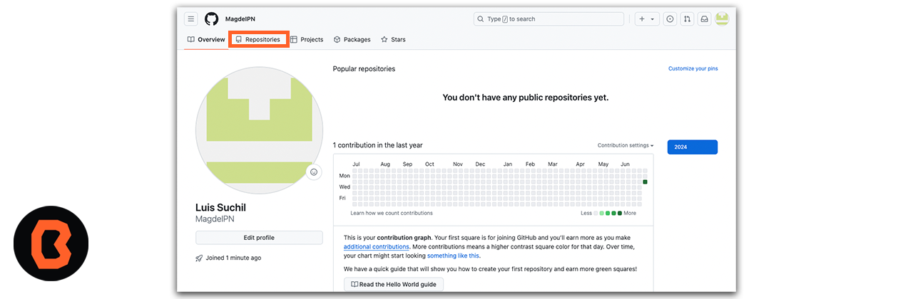
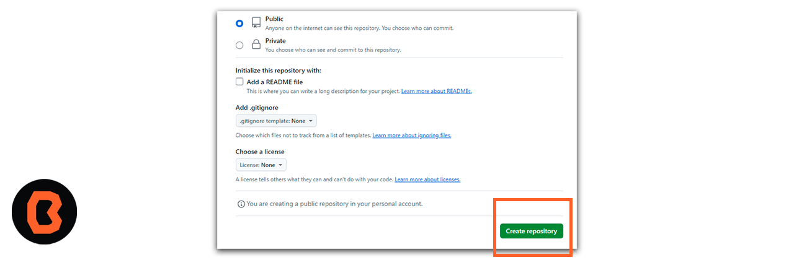
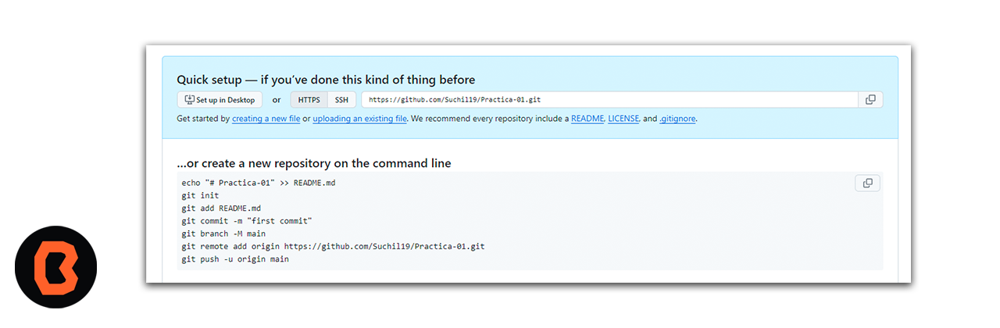

## Creación de cuenta Github
Para empezar a trabajar con GitHub, deberás crear una cuenta personal gratuita en GitHub.com 
Abre tu navegador y accede al siguiente enlace <a href="https://github.com/signup?ref_cta=Sign+up&ref_loc=header+logged+out&ref_page=%2Flogos&source=header">Crea tu cuenta en Github</a>
 y comprobar la dirección de correo electrónico.

* Durante el registro, se te pedirá que verifiques tu dirección de correo electrónico. Sin una dirección de correo electrónico verificada, no podrás completar algunas tareas básicas de GitHub, como crear un repositorio.

* Ahora crea un nombre de usuario, es importante ya que en un futuro haremos referencia a ese nombre de usuario.

* Una vez creada la cuenta tendremos la siguiente pantalla, para esta sesión tienes que dirigirte a la sección de repositorios.

* En la sección de repositorios puedes crear un repositorio nuevo, ahora tienes que elegir un nombre **sin espacios** para poder continuar.

* Debes elegir la opción de que tu repositorio sea público y por último presionar el boton verde en la parte inferior derecha y crear el repositorio.

* Genial ahora ya creaste tu primer repositorio , vamos a poner una pausa y no cierres esta ventana, por favor continua ahora con la instalación de Git.

