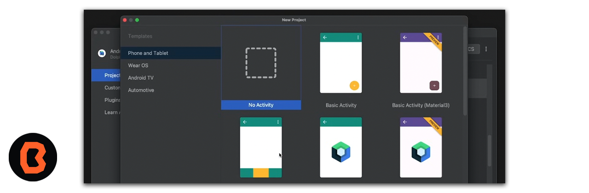
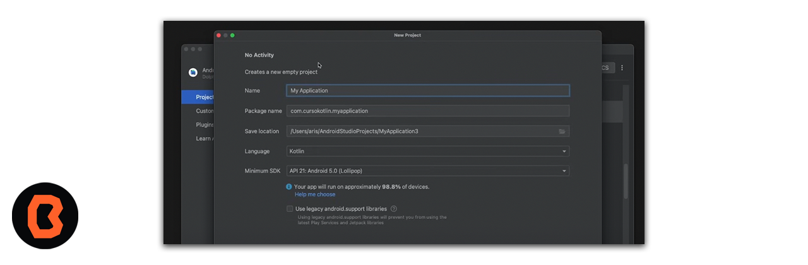
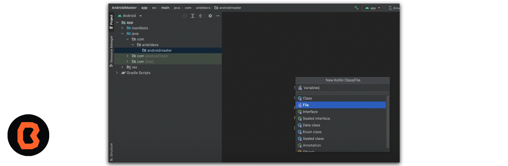
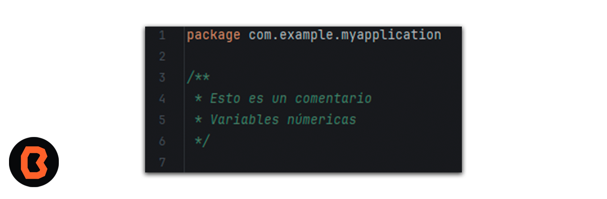
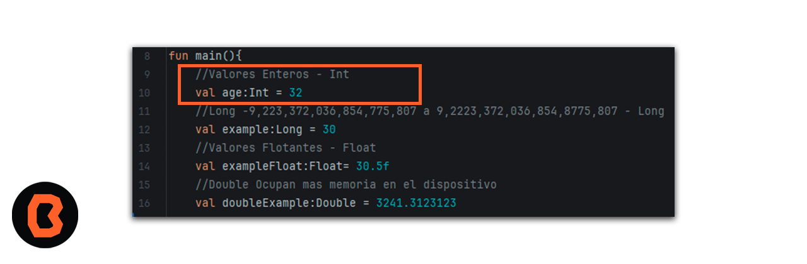
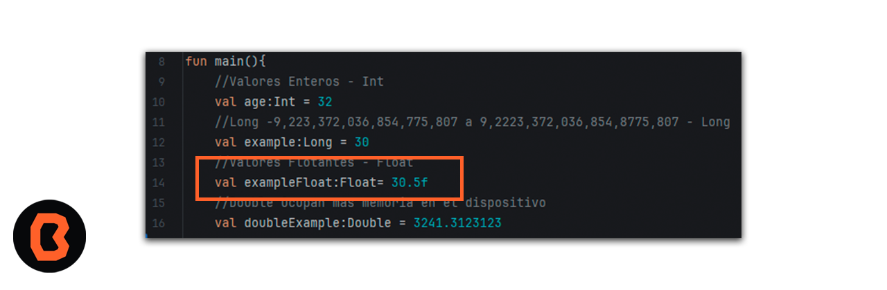
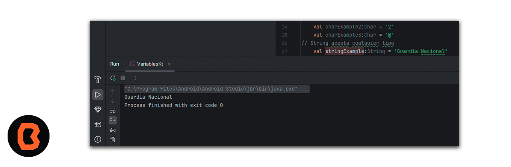

## Define y usa variables

Cuando defines una variable, le asignas un nombre para identificarla de manera única. También debes decidir qué tipo de datos puede contener mediante la especificación del tipo de datos. Por último, puedes proporcionar un valor inicial que se almacenará en la variable, pero es opcional.

Cada vez que tu código necesite acceder a la cantidad de mensajes no leídos, escribe count. Cuando ejecutas tus instrucciones, el compilador ve el nombre de la variable en tu código y usa el valor de la variable en su lugar.

## Crea un proyecto Nuevo

Crea un nuevo proyecto. Abre Android Studio y en esta ocasión crea un No Activity como se muestra a continuación.

 

 Ahora tendremos que crear el proyecto y esperar a que los recursos carguen de forma correcta.

  

Tienes que crear un archivo de Java llamado variables dentro de tu proyecto como se muestra a continuación:

  

Ahora tienes que correr tu programa para mostrar el print que quieras mostrar, a continuación los ejemplos que veremos en la práctica, primero vas a identificar como se escribe un comentario, como se observa en la siguiente imagen.

   

## Datos Enteros (Int)

  * Ahora vamos a comenzar a hablar de los valores **enteros** este grupo incluye byte, short, int y long. Estos tipos de datos nos permiten trabajar con números enteros ya sean positivos o negativos.

    - long: bytes 8, rango (–9,223,372,036,854,775,808 a 9,223,372,036,854,775,807) 
    - int: bytes 4, rango (–9,223,372,036,854,775,808 a 9,223,372,036,854,775,807)
    - short bytes 2, rango (	–32,768 to 32,767)
    - byte: bytes 1, rango (	–128 to 127)

## Flotantes / Decimales

* Este grupo incluye float y double. Estos tipos de datos nos permiten trabajar con números los cuales posean punto decimal ya sean positivos o negativos

    - double: bytes 8, rango (4.9e–324 to 1.8e+308) 
    - float: bytes 4, rango (1.4e–045 to 3.4e+038)

## Resultado

Recuerda estar monitoreando tus resultados para adquirir mayor práctica con los tipos de datos.

