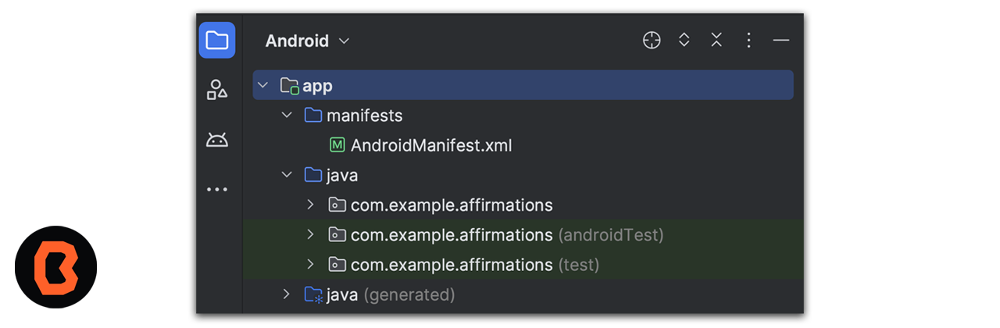
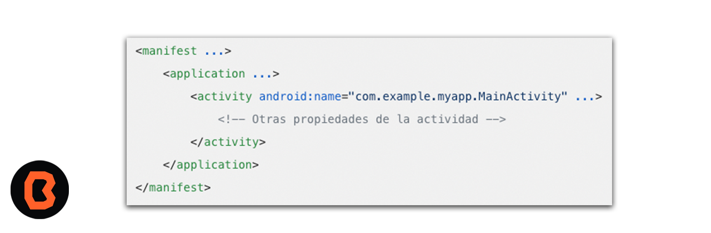

# Sesión 05 - Estructura de aplicaciones y Codificación en Java

La estructura de un proyecto en Android Studio sigue una convención estándar que facilita la organización y navegación del código.

## 🎯 Objetivo

Identificar los módulos que incluye Android cuando creamos un proyecto. además aprenderás lo siguiente

* Identificar los módulos que incluye Android cuando creamos un proyecto.
* Comprender atributos, métodos y clases heredadas.
* Crear objetos y clases en Java

## Estructura de aplicaciones - Módulos

* Módulos de apps para Android : son extensiones o complementos que permiten modificar o añadir funcionalidades al sistema operativo
* Módulos de biblioteca: son componentes que permiten organizar y reutilizar código en proyectos
* Módulos de Google App Engine: son componentes que te permiten integrar tu aplicación de Android con Google App Engine, la plataforma de desarrollo y alojamiento de Google.

Android Studio muestra los archivos de tu proyecto en la vista de proyecto de Android, como se ve en la siguiente figura.

* Cada Módulo contiene lo siguiente

1. **manifest**: Contiene el archivo AndroidManifest.xml, que es fundamental para crear una aplicación de Android. Este archivo describe información esencial sobre tu app a las herramientas de compilación de Android, al sistema operativo Android y a Google Play.
    * **Componentes de la app**: Cada componente de la app (como actividades, servicios, receptores de difusión y proveedores de contenido) debe definirse en el archivo de manifest como se muestra en la siguiente figura.

    

    * **Permisos** El archivo de manifest también declara los permisos que la app necesita para acceder a partes protegidas del sistema o a otras apps. Además, especifica permisos que otras apps deben tener para acceder al contenido de esta app.

    * **Características de hardware y software**: El manifest también describe las características de hardware y software que la app requiere, lo que afecta qué dispositivos pueden instalar la app desde Google Play.
- [Ejercicio Manifest](ejercicio-manifest/README.md)

2. **java**: contiene el código fuente de tu aplicación, archivos de recursos y configuraciones específicas del nivel del módulo, como el archivo de compilación y el manifest de Android.
- [Ejercicio java](ejercicio-java/README.md)
3. **res**: Contiene recursos esenciales para tu aplicación, como layouts, imágenes (drawables), strings, etc.

- [Ejercicio res](ejercicio-res/README.md)

# Codificación en Java

Aprenderás a crear objetos y clases en Java, respasarás atributos, métodos y clases heredadas.

- **Objetos y clases**: Las clases son como planos de diseño para crear objetos y los objetos son instancias de una clase.
- **Atributos de una clase**: son las propiedades o variables que comparten todos los objetos creados a partir de esa clase. Estas propiedades definen los atributos o características específicas de los objetos.
- **Métodos de una clase**: son bloques de código que definen el comportamiento y las acciones que pueden realizar los objetos creados a partir de esa clase.
- **Clases heredadas**: la herencia te permite construir jerarquías de clases y compartir funcionalidad entre ellas.

## 📝 Organización de la clase

* Estructura de aplicaciones
- [Ejercicio Manifest](ejercicio-manifest/README.md)
- [Ejercicio java](ejercicio-java/README.md)
- [Ejercicio res](ejercicio-res/README.md)
* Prácticas Codificación en Java
- [Objetos y clases](practica-objetos-clases/README.md)
- [Atributos de una clase](practica-atributos/README.md/README.md)
- [Métodos de una clase](practica-metodos/README.md)
- [Clases heredadas](practica-clases-heredadas/README.md)
* Presentación
- [Presentación - Sesión 03](presentacion/Sesion-05.pptx)