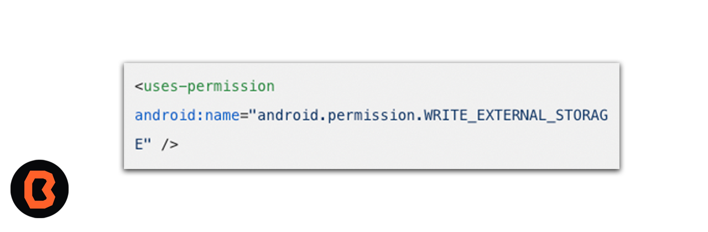
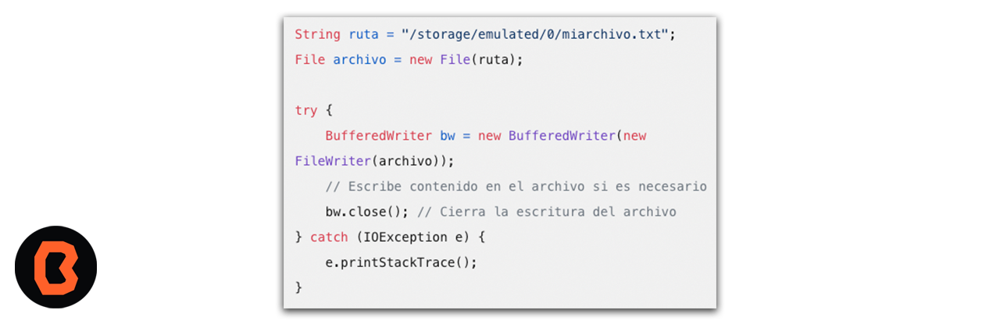

## Archivo nuevo Java

* Para crear un archivo en Android Studio sigue estos pasos.

1. Declarar permisos: Asegúrate de declarar el permiso necesario en tu archivo AndroidManifest.xml. Agrega la siguiente línea para permitir la escritura en almacenamiento externo:

2. Crear el archivo: Puedes crear un archivo en la memoria interna o externa. ejemplo para crear un archivo en la memoria externa:

* Asegúrate de manejar excepciones y de adaptar la ruta y el contenido del archivo según tus necesidades.