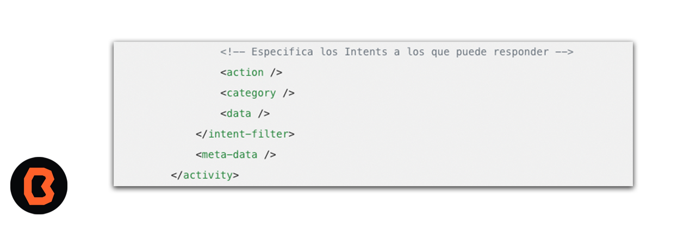
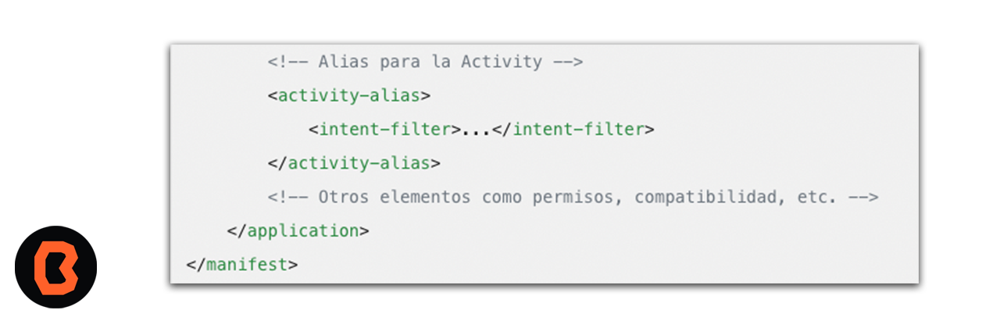

# Crear archivo Manifest

* Ahora crearás un archivo manifest que es fundamental en un proyecto Android, y cada aplicación debe contenerlo en su directorio raíz.

## Archivo AndroidManifest

El archivo AndroidManifest.xml describe la configuración de tu aplicación. Contiene información sobre componentes, permisos, versiones de Android compatibles y más.

## Funciones principales y sus características

- Nombre del paquete: Define un nombre único para tu aplicación.
- Componentes de la aplicación: Especifica las Activities, Services, Content Providers, etc.
- Activity inicial: Indica qué Activity se lanza al abrir la aplicación.
- Nivel mínimo de API: Declara la versión mínima de Android requerida.
- Permisos: Enumera los permisos necesarios para tareas específicas (como acceder a contactos o realizar llamadas).

## Está es la estructura general del archivo

- Elemento raíz del fichero.

- Especifica los Intents a los que puede responder.

- Alias para la Activity

## Ahora es tu turno: Agrega permisos

- Haz clic con el botón derecho en la etiqueta de la aplicación en AndroidManifest.xml.
- Selecciona “Generar” > “Etiqueta XML”.
- Luego, agrega el permiso necesario.