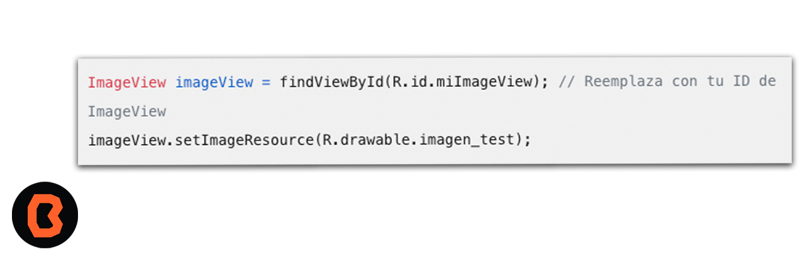

## Crear una carpeta res y agregar un recurso multimedia.
Recuerda que la carpeta res es fundamental para organizar los recursos de tu aplicación, como imágenes, layouts y valores, tienes dos opciones para agregar recursos multimedia.

## Método 1: Arrastrar y soltar
1. Abre tu proyecto en Android Studio.
2. En la ventana “Project”, selecciona la vista de Android.
3. Encuentra la carpeta res.
4. Abre la carpeta res y luego la carpeta drawable.
5. Arrastra la imagen que deseas agregar desde tu explorador de archivos y suéltala en la carpeta drawable.

## Método 2: Crear una carpeta personalizada
1. Haz clic derecho en la carpeta res.
2. Selecciona “New” > “Folder”.
3. Elige “Res Folder” y haz clic en “Next”.
4. En la ventana emergente, selecciona “Change Folder Location”.
5. Cambia el nombre de la nueva carpeta creada (por ejemplo, “Hola”) en el formato: src/main/res/Hola.
6. Haz clic en “Finish”.

* Para referenciar una imagen en tu código de Android Studio, sigue estos pasos:
- Asegúrate de que la imagen esté en la carpeta res/drawable.
- Usa el ID de la imagen en res/drawable:
- En tu código, utiliza el método setImageResource() en un ImageView para asignar la imagen. Por ejemplo, si tu imagen se llama “imagen_test.png”, el código sería el siguiente:

