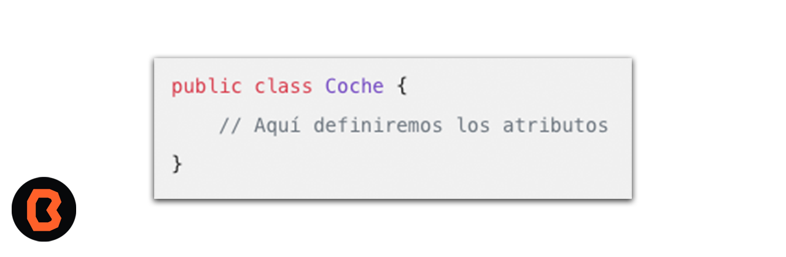

## Atributos de una clase

* En Java, los atributos de una clase se definen dentro de la clase misma.

## Requisitos 
1. Android Studio
2. Conocimientos elementales de programación. 

## Clase

- Crea una clase utilizando la palabra clave class.
El nombre de la clase debe ser único y significativo.

 - Aprenderás acerca de atributos de una clase.

## Atributos (Propiedades):
* Declara las propiedades dentro de la clase.

## Acceso a los Atributos:
Puedes acceder a los atributos utilizando una instancia de la clase.

