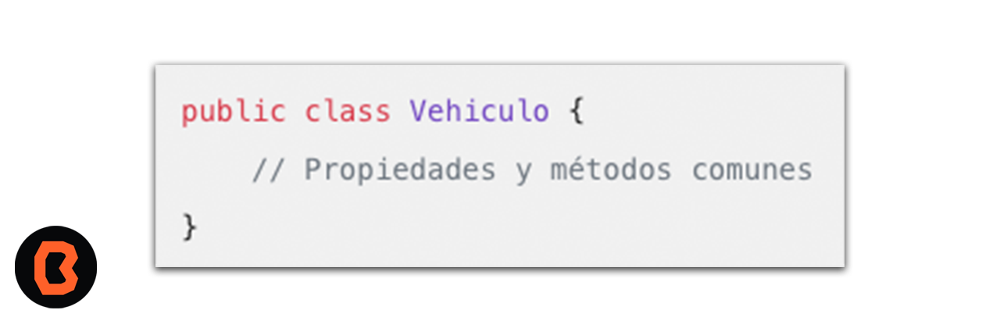

## Clase heredada

* Crear una clase heredada android : La herencia te permite reutilizar código y crear relaciones entre clases para modelar jerarquías de objetos.

* Definición de la Clase Base:
Crea una clase base utilizando la palabra clave class.
El nombre de la clase base debe ser único y significativo.

Definición de la Clase Base:
Crea una clase base utilizando la palabra clave class.
El nombre de la clase base debe ser único y significativo.

* Luego, crea la subclase que heredará de la clase base.
Utiliza la palabra clave class seguida del nombre de la subclase y la palabra clave :, seguida del nombre de la clase base.

* La herencia te permite reutilizar código y crear relaciones entre clases para modelar jerarquías de objetos. 