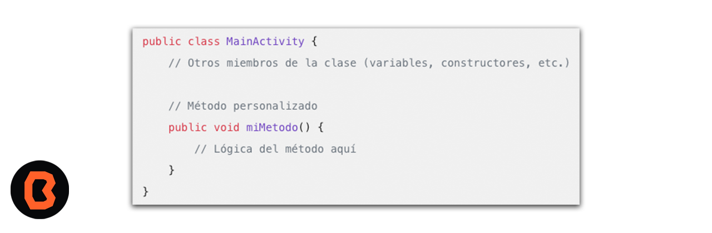
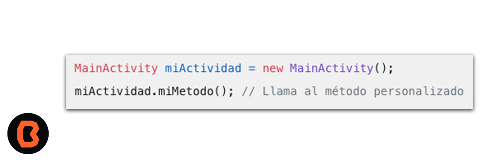

## Método de una clase

## OBJETIVO 
 - Crear una clase heredada.

#### REQUISITOS 
- Android Studio
- Nociones básicas de programación.

## DESARROLLO
1. Definir una clase: Primero, asegúrate que tienes una clase definida en tu archivo .java (por ejemplo, MainActivity.java). 
* Si aún no tienes una, crea una clase que represente la funcionalidad que deseas crear.
Agregar métodos a la clase:
* Abre el archivo de la clase (por ejemplo, MainActivity.java).
Dentro de la definición de la clase, puedes agregar métodos. Por ejemplo:

2. Agregar métodos a la clase:
* Abre el archivo de la clase (por ejemplo, MainActivity.java).
* Dentro de la definición de la clase, puedes agregar métodos. Por ejemplo:

3. Llama a los métodos desde otra parte del código:
* En cualquier otra parte de tu aplicación (otra clase, actividad, etc.), puedes crear una instancia de la clase MainActivity y llamar a sus métodos. Por ejemplo:

* Los métodos te permiten encapsular lógica y funcionalidad dentro de una clase, lo que facilita la organización y reutilización del código.

[Práctica Metodos](practica)

