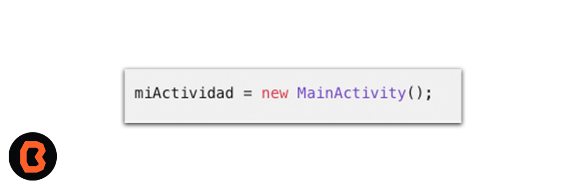
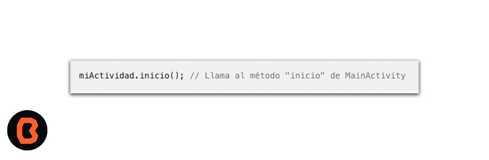

## Sesion 04 - Reto 01

## OBJETIVO 
 - Crear un objeto en MainActivity.java 
 
## REQUISITOS 
1. Android Studio
2. Conocimientos básicos de programación. 

## DESARROLLO
- Definir una clase: Primero, asegúrate de que tienes una clase definida en tu archivo MainActivity.java. 

- Clases: Las clases proporcionan una estructura para crear objetos. Las clases encapsulan datos y comportamiento.

- Si no hay una, crea una clase que represente la funcionalidad que deseas implementar1.
- Declara una variable del tipo de clase: Declara una variable de tipo MainActivity (o el nombre de tu clase) en el lugar donde deseas crear el objeto. Como se muestra a continuación:

* Crear el objeto: Utiliza la palabra clave new seguida del constructor de la clase para crear el objeto. Por ejemplo:

* Acceder a los miembros del objeto: Ahora puedes acceder a los métodos y propiedades de la clase MainActivity a través de la variable miActividad. Por ejemplo:

* Con esto termianmos el proceso de aprovechar al máximo l acreación de Objetos.

[Práctica Objetos y Clases](practica)