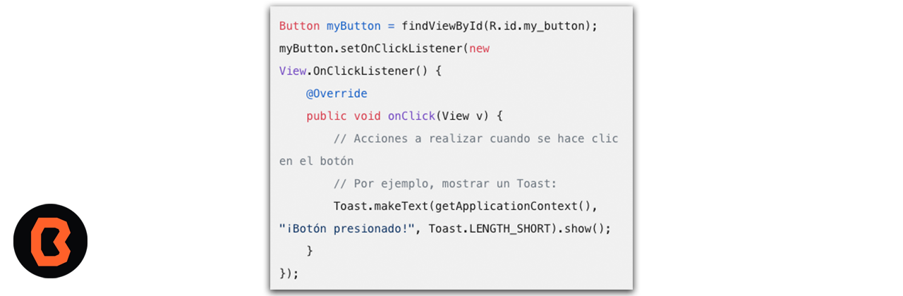

## Vinculación entre Java y XML 

Esta vinculación es fundamental para trabajar con datos estructurados en aplicaciones Java. 

* DOM (Document Object Model) Parsers:
Los parsers DOM trabajan con todo el documento XML, cargándolo en memoria y construyendo una representación en forma de árbol. Esto permite acceder y manipular los elementos del XML.
* Ejemplo de generación de un documento XML desde Java con DOM:
JAXB (Java Architecture for XML Binding): es una API que facilita la vinculación entre objetos Java y documentos XML. Puedes trabajar cómodamente con XML y JSON utilizando anotaciones de JAXB.

* JiBX, JAXB y XMLBeans son otras opciones para vincular datos en XML con objetos Java. Estas librerías te permiten generar código Java a partir de un esquema XML. Puedes elegir la que mejor se adapte a tus necesidades.

## 🎯 Objetivos
- Identificar cómo Java y XML se combinan gracias al archivo R.java
- Identificar el impacto de la modificación de un objeto en Java, en la interfaz gráfica.
- Definir el funcionamiento de los  onClickListener.
- Comprender el impacto de las modificaciones a los objetos con los ClickListeners.

 
- [Ejemplo 01](Ejemplo-01)

## Uso de OnClickListeners

En tu código Java, puedes asignar un OnClickListener a un botón de la siguiente manera:

Implementando View.OnClickListener en la actividad o fragmento:
Puedes hacer que tu actividad o fragmento implemente directamente la interfaz View.OnClickListener. Luego, sobrescribe el método onClick(View view) para manejar el evento de clic:

## 📝 Organización de la clase

- [Ejemplo](Ejemplo-01)
- [Presentación - Sesión 06](presentacion/Sesion-06.pptx)