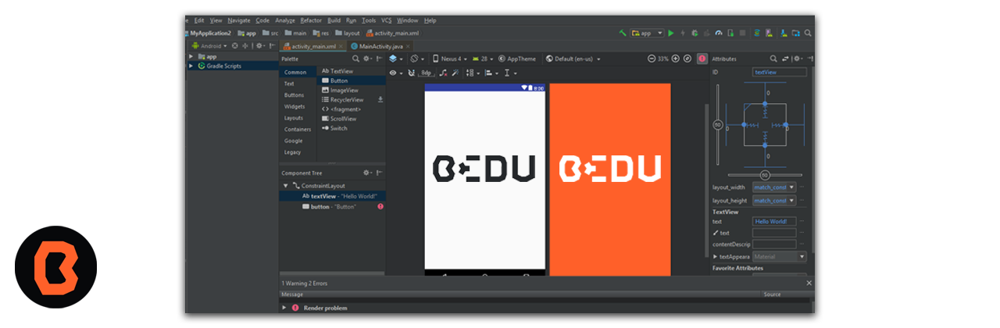
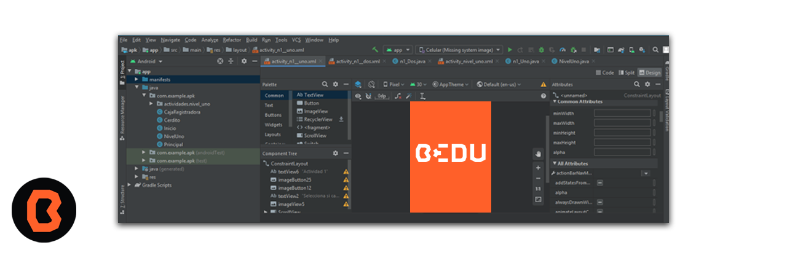

# Sesión 07 - Programación de Activities

 Los Activities son componentes fundamentales en Android Studio.

 Una Activity es un componente de aplicación que proporciona una pantalla con la que los usuarios pueden interactuar. Por ejemplo, una Activity puede representar una pantalla para marcar el teléfono, tomar una foto, enviar un correo electrónico o ver un mapa.

 Cada Activity se implementa como una subclase de la clase Activity. Proporciona la ventana en la que la aplicación dibuja su interfaz de usuario (UI). Generalmente, una Activity representa una sola pantalla en la aplicación.

## 🎯 Objetivo

- Identificar las características de un “Activity”
- Comprender la secuencia para accionar Actividades en la aplicación
- Crear una Activity

## Importancia de Activities

Las aplicaciones móviles no siempre comienzan en el mismo lugar. Por ejemplo, al abrir una aplicación de correo electrónico desde la pantalla de inicio, verás una lista de correos. Sin embargo, si una aplicación de redes sociales lanza la aplicación de correo electrónico, irás directamente a la pantalla de creación de correos.

Cada Activity sirve como punto de entrada para la interacción del usuario con la aplicación. Implementas una Activity como una ventana o pantalla en la aplicación.

## **Main Activitie**

En la mayoría de las aplicaciones, una Activity se especifica como la main activity, que es la primera pantalla que aparece cuando el usuario inicia la aplicación.

Cada Activity puede iniciar otra Activity para realizar diferentes acciones. Por ejemplo, una main activity de una aplicación de correo electrónico podría mostrar la bandeja de entrada y luego lanzar otras Activities para escribir correos o ver mensajes individuales.

## Intent
Un intent es un objeto que declara la intención de realizar una acción. Básicamente, es una descripción de lo que tu app desea hacer. Hay dos tipos principales de intents:

1. Intent explícito: Se utiliza para navegar a una actividad específica dentro de tu propia app. Por ejemplo, si tienes una app con varias pantallas, puedes usar un intent explícito para pasar de una pantalla a otra.

2. Intent implícito: Este tipo de intent se utiliza para interactuar con otras apps o componentes del sistema. Por ejemplo, puedes usar un intent implícito para abrir el navegador web o compartir contenido en redes sociales.

## Ejercicio - Crear un botón con una imagen

Crear un botón con una imagen en Android Studio

- [Ejercicio Activities](ejercicio/README.md)

## Práctica

Aprenderás a trabajar con dos actividades en Android Studio:

- [Práctica Activities](practica/README.md)

## 📝 Organización de la clase

- [Práctica](practica/README.md)
- [Presentación - Sesión 07](presentacion/Sesion-07.pptx)

