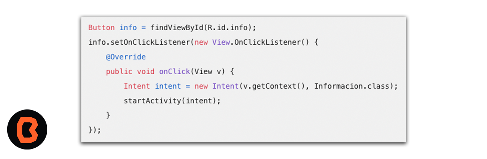

# Ejercicio 01: Creando Activities”
Recuerda que puedes personalizar el tipo de Activity según tus necesidades (por ejemplo, Empty Activity, Bottom Navigation Activity, etc.)

- Asistente de Android Studio:

    1. En el apartado de archivo haz clic derecho en la carpeta donde deseas crear la Activity (por ejemplo, app/src/main/java/com/tu_paquete/).
    2. Selecciona New > Activity > Blank Activity.
    3. Proporciona un nombre para la clase Java y el archivo de diseño (layout).
    4. El asistente generará automáticamente los archivos necesarios y registrará la Activity en el archivo AndroidManifest.xml.

- Manualmente:
    1. Crea una nueva clase Java en la ubicación deseada.
    2. Extiende la clase de Activity o AppCompatActivity.
    3. Implementa el método onCreate y vincula el diseño con setContentView(R.layout.tu_layout).
    4. No olvides declarar la Activity en el archivo AndroidManifest.xml.

## Creación de botones

Crear un botón con una imagen en Android Studio es una tarea útil y visualmente atractiva. 

1. Selecciona la imagen adecuada:
    - Elige una imagen clara y relevante para la función del botón. Debe ser preferiblemente de alta resolución.
2. Crea un botón en el diseño principal (Activity Main):
    - Arrastra un botón desde la paleta de elementos al diseño principal (activity_main.xml).
    - Asigna un ID único al botón en la sección de atributos (Declared Attributes).
3. Agrega la imagen al botón:
    - Abre tu proyecto en Android Studio.
    - Ve a la carpeta “res” y haz clic con el botón derecho en la carpeta “drawable”.
    - Selecciona “New” y luego “Image Asset”.
    - Elige “Image” como el tipo de recurso.
    - Selecciona la imagen que deseas usar para el botón y haz clic en “Next”.
4. Configura el botón:
    - En el archivo MainActivity.java, asigna un OnClickListener al botón.
    - Dentro del OnClickListener, crea un Intent para abrir la nueva actividad (layout) cuando se presione el botón.
    - Asegúrate de que el ID del botón coincida con el que asignaste en el diseño principal.
5. Crea la nueva actividad (layout):
    - En el explorador de archivos, expande la carpeta “layout”.
    - Crea un nuevo layout (archivo XML) para la segunda actividad (por ejemplo, Informacion.xml).
    - Diseña la interfaz de la segunda actividad según tus necesidades.
6. Inicia la nueva actividad desde el botón:
    - En el OnClickListener, utiliza el Intent para abrir la nueva actividad:

Ahora tienes un botón con una imagen que abre una segunda actividad en tu aplicación.

