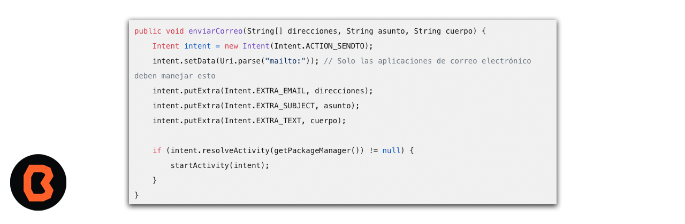
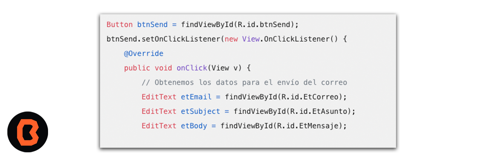
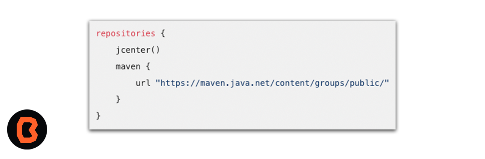

## Envío de correos electrónicos por Intent

Es posible enviar correos electrónicos desde una aplicación creada en Android Studio. Para lograrlo, puedes utilizar las API de correo electrónico proporcionadas por Google en su biblioteca de servicios de Google Play. 
Aquí tienes un ejemplo de cómo enviar un correo electrónico utilizando un Intent:

También puedes utilizar un Intent para abrir la aplicación de correo electrónico predeterminada del dispositivo y prellenar los campos del correo. Aquí tienes un ejemplo de cómo hacerlo:

Asegúrate de que tu diseño de activity_main.xml contenga los campos de entrada (EditText) para el correo, asunto y mensaje, así como un botón para enviar.

## JavaMail para Android

Si quieres más control sobre el proceso de envío de correos electrónicos, puedes utilizar la biblioteca JavaMail para Android. Agrega la siguiente configuración en tu archivo build.gradle:

Luego, puedes implementar la lógica de envío de correos electrónicos utilizando JavaMail. Ten en cuenta que este enfoque requiere configurar correctamente las credenciales del servidor de correo saliente (SMTP).

