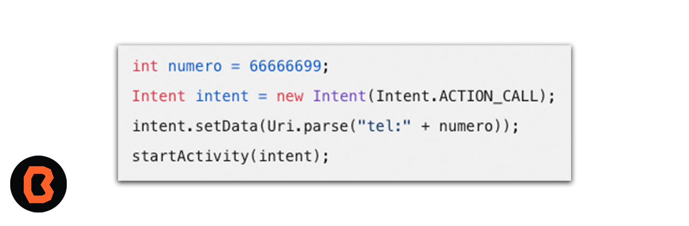
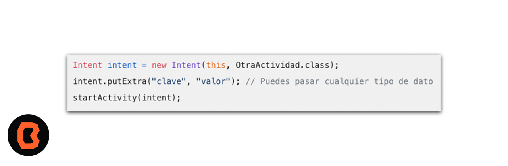

## Intents para generar llamadas telefónicas

En Android Studio, puedes utilizar Intents para comunicarte con otras aplicaciones o componentes del sistema.

1. Lanzar una actividad en otra aplicación:
    - Puedes usar un Intent para abrir una actividad específica en otra aplicación. Por ejemplo, para hacer una llamada telefónica

Asegúrate de tener el permiso android.permission.CALL_PHONE en tu archivo AndroidManifest.xml.

2. Pasar datos entre actividades:
    - Si deseas enviar datos de una actividad a otra, puedes usar Intents. Por ejemplo, para pasar datos de una actividad a otra, puedes hacer lo siguiente:

Luego, en la actividad receptora, puedes recuperar los datos:

3. Transmitir una emisión a otras aplicaciones:
Puedes usar sendBroadcast() o sendOrderedBroadcast() para enviar una emisión a otras aplicaciones. Esto es útil para notificar a otras aplicaciones sobre eventos o cambios en tu aplicación.