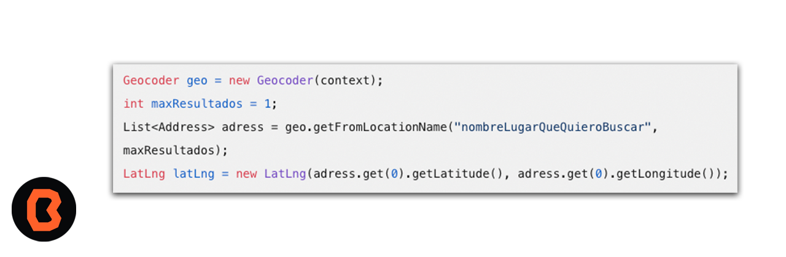

## Búsqueda lugares con Google Maps

1. Configura tu entorno de desarrollo

2. Crea un proyecto en Android Studio:
    - Abre Android Studio y selecciona “Nuevo Proyecto”.
    - Elige “Sin Actividad” en la categoría “Teléfono y Tablet”.
    - Completa el formulario:
    - Establece el lenguaje (Java o Kotlin).
    - Selecciona una versión de SDK compatible con tu dispositivo de prueba (mínimo Android API Level 21 o superior).

3. Integra Google Maps.
Asegúrate de tener un dispositivo Android o un emulador con Google APIs (Android 5.0 o superior).

